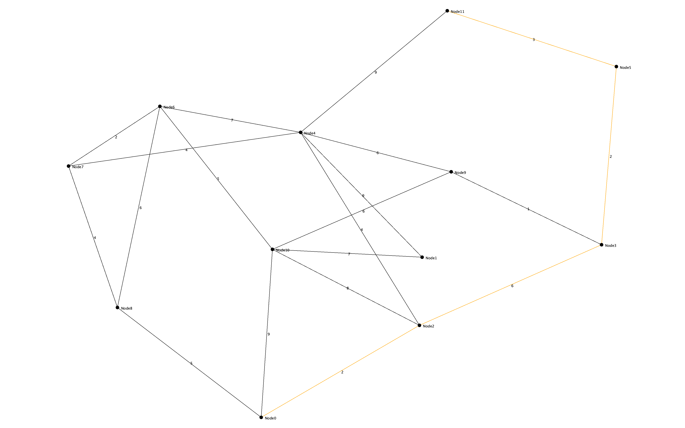
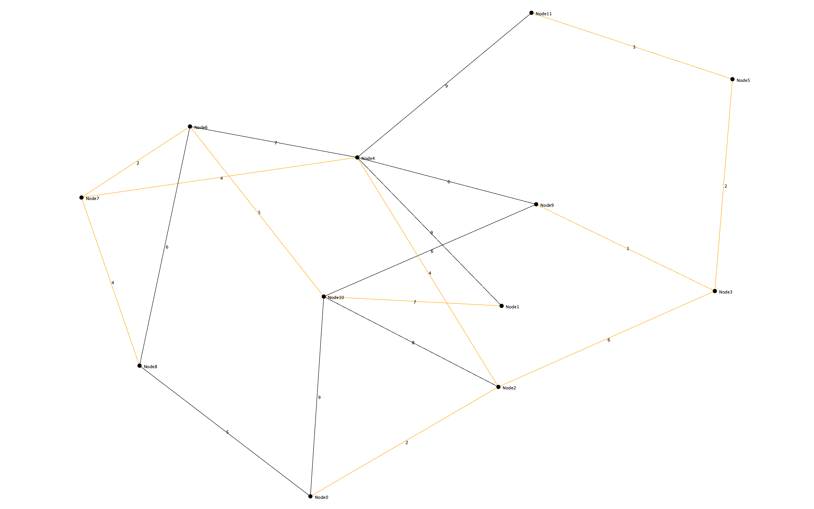
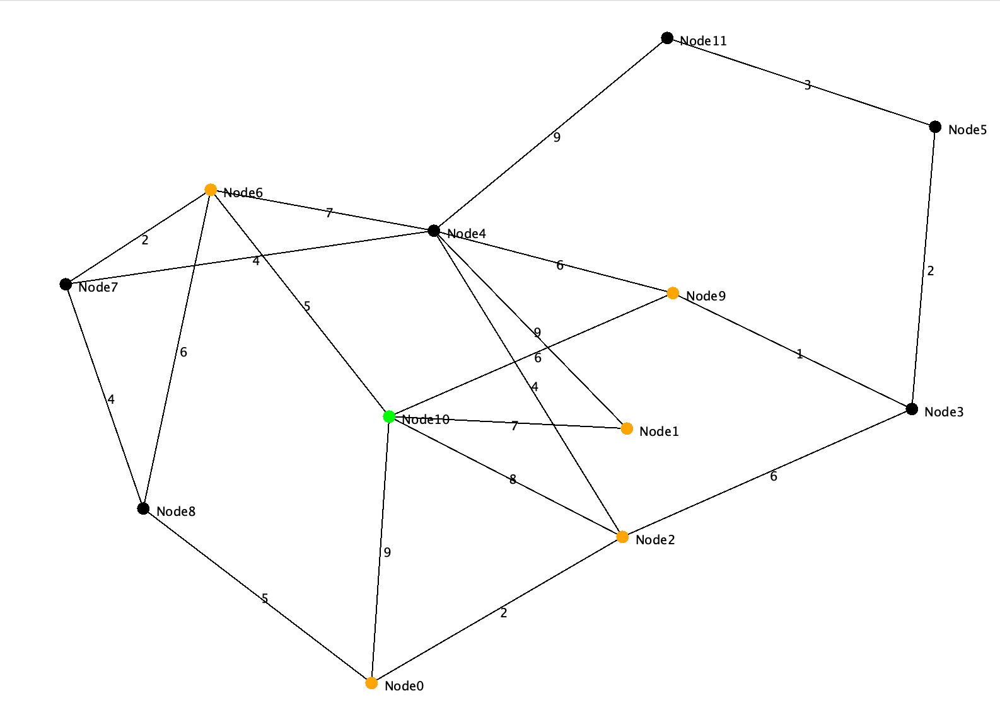
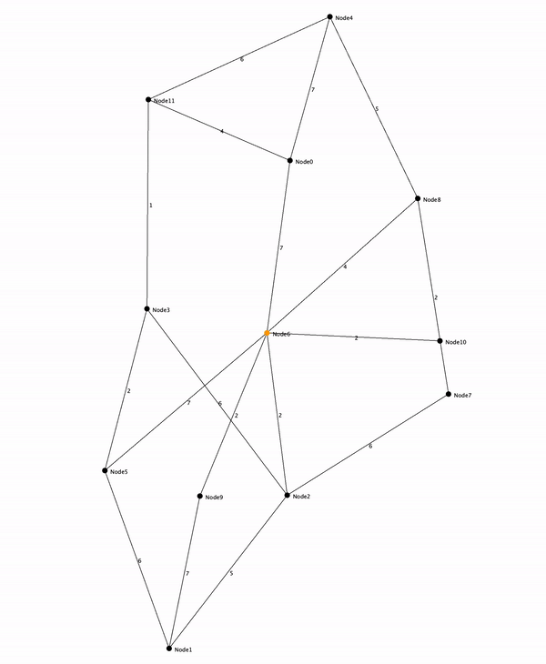

# DabblingWithGraphs
This Java program allows users to input commands in the command line interface (CLI) to generate and analyze graphs. The program offers two options: generating a random number of nodes graph or inputting a number of nodes. After selecting one of the options, the user can choose between computing the Minimum Spanning Tree (MST) of the graph, the shortest path between two input nodes using Dijkstra's algorithm or to compute the BFS.

The program uses the GraphStream library to generate and visualize graphs.

# Requirements
* Java 17 or higher

# Instalation
1. Clone the repository.
2. Import the project into your preferred Java IDE.

# Usage
1. Run the program in your IDE or from the command line.
2. Follow the prompts to select a graph type and analysis method.
3. If generating a graph with user input, enter the number of nodes when prompted.
4. If analyzing shortest paths, enter two nodes to find the shortest path between them.
5. If generating a BFS animation, enter the source node when prompted.

# Design Patterns Used
* Template Method: The AbstractTemplateGenerator class defines the overall structure of the graph generation algorithm and delegates getSizeOfGraph hook method to be implemented by the subclasses.
* Union-Find: The UnionFind data structure is used for the MST calculation algorithm.
* Model-View-Controller (MVC): The program uses the MVC design pattern to separate concerns between the model (graph), user interface (CLI)/ controller (main program logic) and the view.
* Strategy: The program lets the user choose the type of generator at runtime through CLI.

## The shortest weighted path from Node0 to Node11:

## The minimum spanning tree of the graph:

## Snapshot of the BFS search after one step: the first node has been explored and its neighbours have been added to the queue:

## Demonstration of BFS:

